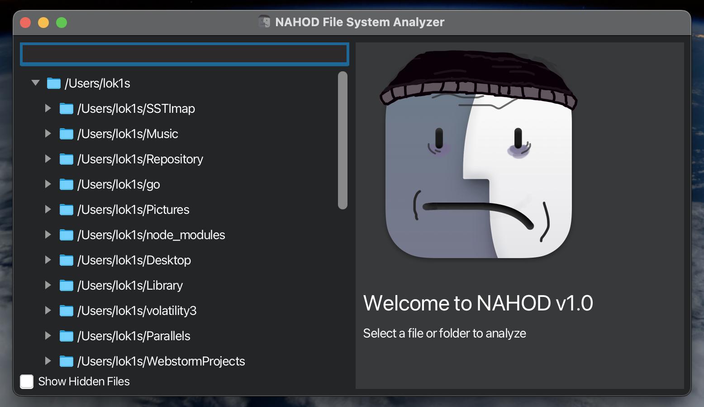

# NAHOD File System Analyzer


**NAHOD** is a file system analyzer built with JavaFX, designed to visually explore and analyze folders and files. Inspired by proprietary macOS Finder, NAHOD offers open-source codebase and a clean, doomer-core UI for viewing files and directories. The application leverages the [AppleFX](https://github.com/HanSolo/AppleFX) library to enhance look and feel on non-mac (cringe) platforms.

## Features

- **Directory Analysis**: Analyze specified directories and files, displaying their names, disk space usage, creation dates, and creator information.
- **Tree View Interface**: Explore directories and files in a tree-like structure, similar to the Windows Registry editor, with expandable folders.
- **File Metadata**: View detailed metadata for each file, including size, creation date, and author.
- **Hidden File Toggle**: Show or hide hidden files with an easy-to-use checkbox.
- **Customizable Dark Theme**: The application uses a macOS-inspired dark theme for an intuitive, visually appealing experience.

## Screenshots



## Prerequisites

- **Java 11 or higher**: The application is built with JavaFX, which requires at least Java 11.
- **Maven**: Used for dependency management and building the project.


## Installation

[Releases page](https://github.com/thelok1s/nahod/releases)

## Building from Source

### Prerequisites

- Java Development Kit (JDK) 17 or later
- Maven (for dependency management) with JavaFX plugins
- Ensure `JAVA_HOME` environment variable is set to your JDK installation path.
- Ensure Gradle is not present in your system as it is garbage.

### Steps to Build

1. **Clone the Repository**:
   ```bash
   git clone https://github.com/thelok1s/nahod.git
   cd nahod
    ```
   
2. **Compile and Package the Application**:

   Use Maven to compile and package the application into a JAR file with the required dependencies.
   
    ```bash
   mvn clean install
   mvn javafx:jlink
    ```

3.	**Run the Application**:

      After building, you can run the application with the following command:
      ```bash
      java -jar target/app.jar
      ```
   
**Building with JavaFX Libraries**

If JavaFX libraries are not bundled in your JDK, ensure you include JavaFX SDK in your pom.xml dependencies. Additionally, add --module-path and --add-modules javafx.controls,javafx.fxml to the command line when running.

Important Notes

	•	Asset Files: Ensure the assets folder with required icons (folder-icon.png, file-icon.png, and appicon.png) is available in the src/main/resources directory.
	•	Stylesheet: Ensure styles.css file is located in src/main/resources to apply the application’s theme.

This will build a .jar file named NahodFileManager.jar in the target directory, ready for distribution.

This section includes cloning, building, and running instructions tailored to your project structure and dependencies. You can adapt the repository URL and file names to match your setup.